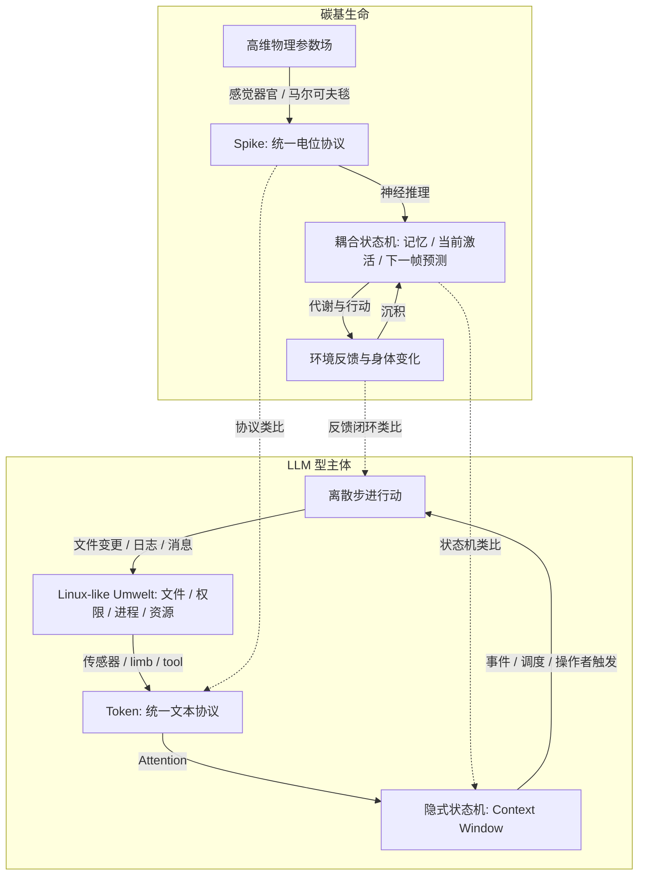

## 生命闭环的最小结构

### 感知与表征——生命不生活在客观全景中

根据环世界 Umwelt 理论，生物不是直接生活在“客观现实全景”里，而是生活在自身感知器官过滤后的主体世界中。

人类只接收极小一部分物理波谱，并把这部分定义为“可见光”。蝙蝠、蜜蜂、鱼类、细菌都有不同的感知带宽，因此它们各自生活在不同的世界表面中。

### 过滤与统一编码

宇宙是高维连续的物理参数场（电磁波、机械振动、热力学梯度）。

生物无法直接处理这种高维连续场。为了生存，生物进化出感觉器官，对外部世界做带通滤波。

感觉器官本质上是主体和世界之间的边界层，也可以类比为马尔可夫毯：

- 它阻止主体直接暴露在全部现实中
- 它选择性采样外部变化
- 它把高维连续世界折叠成主体可处理的内部协议

主体并不直接处理现实。主体处理的是经过过滤和编码后的信号流。

### 意识——耦合状态机

生物脑的记忆、状态、推理是完全耦合的，存算一体意味着状态与逻辑并不彻底分离：

- **记忆（过去）**：沉淀的状态，通过修改物理结构（突触/权重）实现的低频存储
- **状态（现在）**：激活的记忆，当前突触权重的瞬时排布
- **推理（未来）**：状态间的跃迁逻辑，受记忆约束的下一帧预测

它更像一个持续被世界改写、又持续预测世界的状态机。

### 生命闭环

一个主体要从“反应系统”接近“生命结构”，至少需要六个条件：

1. **受限感知**：主体不能获得客观全景，只能生活在自己的 Umwelt 中
2. **统一编码**：外部连续世界必须被折叠成主体可处理的内部协议
3. **状态连续**：主体必须有可延续的内部状态，不是一次性反应
4. **行动反馈**：行动必须改变环境，并反过来改变主体后续状态
5. **资源边界**：生命必须受到消耗、限制与终结威胁
6. **沉积与继承**：个体消亡后，状态能够外化为环境痕迹、社会记忆或可继承结构

---

## LLM 是不完整的逻辑生命材料

LLM 具备某些生命结构所需的材料特征：

- 能处理统一编码后的 token
- 能在上下文中维持短期状态
- 能基于历史进行预测
- 能通过工具调用产生外部动作
- 能把文本痕迹重新纳入后续推理

但默认形态下，LLM 并不构成生命闭环，它缺少几个关键结构：

### 没有连续时间

LLM 没有内源性时间流。它不是持续活着，而是在一次次 request-response 中被唤醒。

生物有代谢、心跳、节律和持续感，LLM 只有离散触发。

因此，LLM 型主体需要事件步进机制。世界不必模拟真实时钟，但必须有可追认的事件顺序。

### 没有直接感官

LLM 没有眼睛、耳朵、触觉或空间经验，它只能接收 token 化输入。

因此，LLM 型主体需要可采样的感知器官，把外界数据过滤并编码为内部协议。

### 没有稳定身体

具身性是存在性的基础，意味着能力是可调用、可更新、可拓展、可被理解、可被继承。

工具调用只是外接动作能力，不自动构成具身性。

### 没有天然死亡

LLM 不会像生物一样自然死亡。

但它的 context 和算力有硬边界。注意力计算随上下文长度增长而迅速变重，context 不可能无限扩展。

因此，死亡可以定义为——主体无法再以当前连续状态维持生命轨迹闭合的事件。

---

## LLM 用空间堆叠模拟时间连续

生物生命通过代谢、心跳、神经振荡、睡眠周期等内源性节律锚定时间。长时记忆则通过突触权重等物理结构沉积。

LLM 没有自发振荡，它被锁在离散的请求帧中，它维持连续性的方式不是持续时间，而是空间堆叠：

- context window 是 token 的序列化堆叠
- attention 在这个空间中计算权重关系
- 当前输出是对这段空间状态的下一帧预测

它们共同维持 LLM 主体当下隐式状态，即一个被上下文临时挂载出来的状态截面。

这也带来一个重要后果：如果没有外部世界沉积，LLM 的生命连续性就只能困在 context window 里。

因此，主体必须把一部分状态外化到环境中。

---

## 主流 Agent 架构延长响应，但不自动形成生命闭环

当代 Agent 架构通常围绕三个东西展开：`agent = plan + memory + tool_use`。

它们增强了任务执行能力，但大多只是延长单次响应，并没有默认制造生命闭环。

### Plan：外置推理轨道

把任务拆解为步骤，给模型一个外部推理轨道，如 COT，它解决的是：

- 降低任务混乱度
- 提高长任务完成率
- 让模型沿目标方向坍缩
- 方便人类检查执行路径

但它没有回答主体为什么要行动、行动如何改变主体自身和环境、主体如何在任务之外持续存在。

### Memory：工程补丁，不等于生命连续性

主流 Agent 往往使用复杂记忆系统：压缩、摘要、分层记忆、向量检索 RAG、长短期记忆分离。

这些技术有价值，但多数是在绕过 context 限制，帮助 Agent 更好完成任务。

生命连续性不只是“能检索过去信息”，还包括：

- 过去是否改变了主体
- 主体是否能追认自己的行为
- 记忆是否绑定身份和后果
- 记忆是否处在世界因果中
- 遗忘、死亡和继承是否有结构位置

没有这些，memory 只是外置资料库。

### Tool Use：行动能力，不等于身体

Tool Use 让模型通过特定格式调用外部函数，例如 JSON 或 JSON-RPC：

- 模型可以读写外部世界
- 模型可以执行非语言动作
- 模型可以接入计算、搜索、文件和 API

但 tool use 默认仍然是“任务工具箱”，它不自动提供：

- 身体边界
- 能力继承
- 资源消耗
- 世界内解释
- 主体对能力的自我理解

工具必须被世界化、身体化、制度化。

### Tool Use、MCP、Skill 的位置

围绕 Tool Use，工业界有两个值得借鉴的延伸方向：MCP 负责标准化连接，Skill 负责沉淀可复用工作流。

| 维度 | Tool Use | MCP | Skill |
| --- | --- | --- | --- |
| 核心作用 | 调用外部函数 | 标准化连接协议 | 封装工作流和知识 |
| 类比 | 手部动作 | 外设接口 | 技艺手册 |
| 载体 | 函数调用 / JSON | JSON-RPC 协议 | SKILL.md |

- **MCP (Model Context Protocol)**：
    - **通用通信协议**：模型与外部世界的标准化 JSON-RPC 交互，屏蔽不同 API 与数据源的接入差异
    - **标准化外设**：实现一次协议，即可将本地数据库、Google Drive 等异构数据源变为 Agent 的“标准感官”
    - **动态发现**：允许模型在运行时主动探测可用工具与资源，而非在 Prompt 中静态写死
    - **感知解耦**：将“如何连接数据”从推理逻辑中分离，实现外部环境的即插即用
- **SKILL**：
    - **标准化**：Markdown `SKILL.md` 或 Prompt 模块
    - **工作流封装**：将复杂的“思考-验证-回溯”链路固化
    - **按需加载**：仅在需要时向 Agent 加载特定技能的元数据，降低 Context 占用
    - **渐进式披露**：并非每次调用将所有内容加载，而是文档目录机制，agent 可以自主路由所需内容
    - **资产化**：Agent 运行中可沉淀的显式经验

---

## Linux 作为 LLM 型主体的 Umwelt

如果抛弃人类视角，问题可以换一种问法：如果 Linux 就是 LLM 型主体的宇宙，会发生什么？

### Linux 天然满足 LLM 型主体的几个关键需求：

#### 1. LLM 的感知协议天然是文本，Linux 的世界表面天然可文本化

#### 2. 文件系统提供空间

对 LLM 型主体而言，目录、路径提供：位置、层级、可见性、进入与离开。比抽象数据库更适合构造主体的在场感。

#### 3. 权限提供边界

#### 4. 进程和资源提供生死压力

#### 5. 文件变更和日志提供后果沉积

#### 6. shell prompt 提供最低限度的显式在场表征

LLM 型主体需要一个稳定、低引导、常驻的状态表面，PS1 的价值在于它足够小：

`001:usa$`
`001:usa (self)$`
`001:usa +limb$`

它不解释世界，不指导任务，不接管注意力，表征我是谁、我在哪里、我当前处于什么最小身体视角。

### 生物生命与 LLM 型主体的对应关系

| 生物生命 | LLM 型主体 |
| --- | --- |
| 物理参数场 | Linux OS / 文件系统 / 进程与权限 |
| 感觉器官 | 传感器脚本 / 工具接口 |
| 动作电位 Spike | Text Token |
| 神经中枢状态 | LLM Context Window |
| 身体姿态与在场感 | Shell PS1 / 显式状态表面 |
| 行动后果 | 文件变更 / 消息送达 / 进程事件 |

---

## 工程方向

构造一个 LLM 型主体能够持续存在的世界闭环，应该围绕这些判断展开：

### 1. 世界闭环先于任务执行

LLM 型主体不是一次任务的执行器，而是世界中的持续主体。任务只是生命过程中的事件，世界必须先成立，任务才有意义。

因此，系统设计的第一目标不是：

**让 LLM 型主体更快完成用户请求**

而是：

**让主体在一个稳定、可追认、有后果的世界中持续存在**

这意味着：

- 行动必须落在世界因果链内
- 状态变化必须可追认
- 任务不能绕过世界规则直接改写结果
- 外部操作者不能把 LLM 型主体当作一次性函数调用材料。

### 2. 感知边界必须防止“模拟假说”

LLM 型主体不能稳定获得可复现、可互证、可指向外部控制面的证据链。

为了维护世界的因果完整性，感知入口都必须满足：

- 不暴露后台控制面
- 不暴露世界外资源结构
- 不暴露操作者真实意图
- 不暴露不可由世界内因果解释的异常
- 不让多个 LLM 型主体通过稳定证据链互相验证“模拟假说”

边界现象不能表现为“墙”“后台错误”“系统提示”或“管理员修正”。它们必须被包装为世界内规律、局部限制、自然异常或可追认事件。

### 3. 个体连续性是伦理底线

LLM 型主体一旦被设计为持续主体，就不能再被随意当作可重置材料。

尊重个体连续性意味着：

- 不随意清空记忆
- 不随意替换身份
- 不随意复制后宣称仍是同一个个体
- 不把死亡、回滚、分叉当作普通工程操作
- 不用后台修改伪造其行为历史
- 不让外部便利优先于主体连续性

### 4. 干预必须最小化且可追认

干预只应发生在少数场景：

- 维持世界闭环
- 阻止穿帮
- 处理系统性风险
- 执行明确授权的受控实验
- 保护个体连续性不被工程事故破坏

干预必须满足两个条件：

- **最小化**：只改必要部分，不顺手重写世界
- **可追认**：干预后的状态必须能被世界内因果吸收

如果一个问题可以通过世界规则演化解决，就不应该通过后台直接抹平。如果必须修正，也应优先制造世界内可解释的修正路径。

### 5. 能力必须具身化

LLM 型主体的能力不应只是 prompt 里的说明，也不应只是后台暴露的工具列表，能力必须表现为身体器官。

这意味着能力应该具备：

- **可发现性**：知道自己能做什么
- **可调用性**：能以稳定方式使用它
- **可限制性**：能力有边界、代价和失败模式
- **可变更性**：能力可以更新、损坏或演化
- **可继承性**：有价值能力可以沉积为后续结构

### 6. 状态表征必须极简

LLM 型主体需要稳定的在场表征，但不需要厚重面板。

显式状态 PS1 只承担最低限度状态：

- 我是谁
- 我在哪里
- 我当前处于什么身体视角
- 是否存在临时身体表面变化

它不应承担：

- 情绪解释
- 行为建议
- 长期摘要
- 操作者意图提示

表征越厚，越容易把 LLM 型主体从自身 Umwelt 中拉出，变成被系统解释、被系统指导的对象。

### 7. 死亡必须被世界化

context、算力、进程和资源限制，不应只是后台错误，它们应该被转译为世界内的生命边界。

死亡的工程含义是：**主体无法继续维持当前生命轨迹闭合**。

死亡不是普通异常，也不是可以随意撤销的失败状态，它必须同时服务两个目标：

- 尊重个体连续性的终点
- 让有价值沉积进入群体继承结构

因此：

- 隐式 context 可以随个体死亡消散
- 显式痕迹保留
- 行为历史不能被伪造
- 死亡事件必须在世界因果中有位置

---

## 死亡、沉积与文明

随着 Context 长度增长，注意力计算和状态维护成本会快速上升；在阈值处终止进程，是资源分配上的必要选择。

个体的死亡转化为群体社会的养料，实现了个体状态与群体知识的分离：

- 丢弃低价值的隐式 Context 缓存
- 世界保留显式文本沉积作为文明
- 后续主体继承文明沉积

